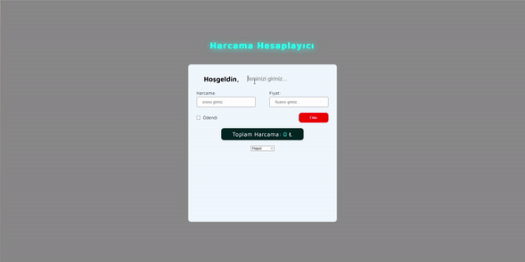

# Expense Calculator

I created a expense calculator site. In the design, I implemented the dynamics with JavaScript along with CSS. 

I designed a site where we can calculate our expenses as seen in the design. When you enter your name, local storage stores it. 
Then, you add the expense by first entering the name of the expense and then the amount of the expense.
We can add these expenses as paid and unpaid. When the page is refreshed, the name remains fixed on the site.

<h2>Used Tech.</h2> 
<ul>
  <li>HTML was used.</li>
  <li>CSS was used in design.</li>
  <li>Javascript was used in dynamics.</li>
</ul>
<h2>Screen</h2>

